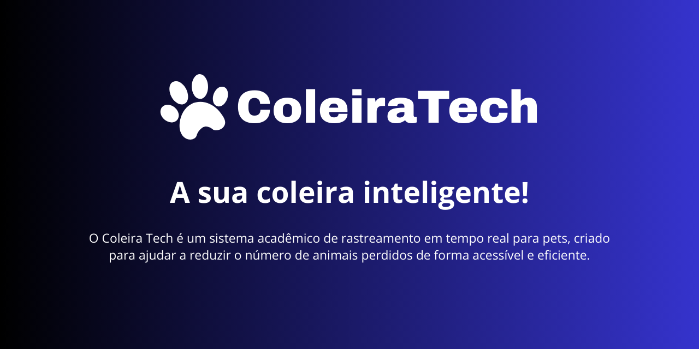

<p align="center">
  
</p>

# 🐾 Coleira Tech – API de Monitoramento para Pets

O **Coleira Tech** é um sistema de rastreamento em tempo real para animais de estimação, desenvolvido como parte de um projeto acadêmico. Seu principal objetivo é reduzir o número de animais perdidos, fornecendo uma solução acessível, confiável e prática para tutores e organizações de proteção animal.

---

## 🚀 Tecnologias Utilizadas

- **Java 21**
- **Spring Boot**
- **PostgreSQL**
- **Docker e Docker Compose**
- **Módulo A9G (GPS + GPRS)**
- **HTTP (comunicação via POST)**
- **API RESTful**

---

## ⚙️ Funcionalidades

- Receber dados de localização (latitude, longitude, data/hora, identificador do animal).
- Salvar os dados em um banco PostgreSQL.
- Consultar:
  - Última localização do pet.
  - Histórico completo de localizações, com filtro por data.
- Relacionar pets com seus donos e suas coleiras.

---

## 🧱 Estrutura do Projeto

```
coleira-tech-api
├── src
│   ├── main
│   │   ├── java/com/coleiratech
│   │   │   ├── controller     # Endpoints REST
│   │   │   ├── model          # Entidades JPA
│   │   │   ├── repository     # Interfaces de persistência
│   │   │   └── service        # Regras de negócio
│   │   └── resources
│   │       └── application.properties
├── Dockerfile
├── docker-compose.yml
├── README.md
└── pom.xml
```

---

## ▶️ Como Executar

### Pré-requisitos

- Docker e Docker Compose instalados
- Java 21 (caso prefira rodar localmente sem container)

### Executar com Docker

```bash
docker-compose up --build
```

### Executar Localmente (sem Docker)

1. Configure o banco PostgreSQL com as credenciais do `application.properties`.
2. Compile e execute:

```bash
./mvnw spring-boot:run
```

---

## 📬 Endpoints da API

Todos os endpoints estão sob o caminho base: `/api`

| Método | Endpoint                         | Descrição                                 |
|--------|----------------------------------|-------------------------------------------|
| POST   | `/api/localizacoes`             | Envia uma nova localização do pet         |
| GET    | `/api/localizacoes/ultimas/{id}`| Última localização do pet por ID          |
| GET    | `/api/localizacoes/historico/{id}`| Histórico completo de localizações        |

---

## 📄 Licença

Este projeto está licenciado sob a **MIT License** – veja o arquivo [LICENSE](LICENSE) para mais detalhes.

---

## 👨‍💻 Desenvolvedores

Este projeto foi idealizado e desenvolvido por estudantes de Engenharia da Computação como parte do projeto integrador da graduação.

Contribuições são muito bem-vindas! 💙
